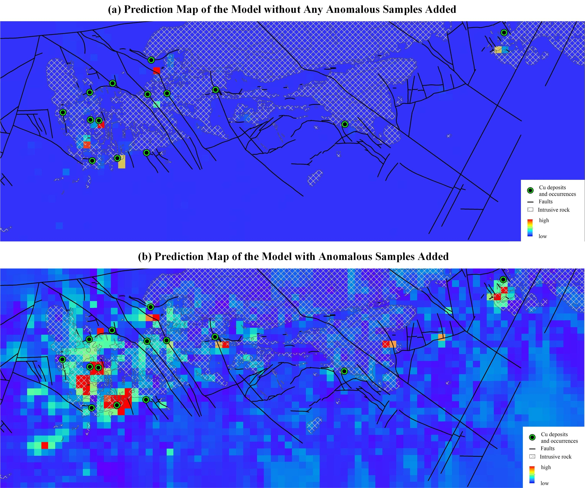

# Geo-Hgan-Unsupervised-Anomaly-Detection-via-mining-latent-space-features

## Research roadmap

## Code Running Guide

### Step1: Train the Latent Space Learning Module
To train the latent space learning module, run the "train_LSTM.py" file. In this file, the "autoencoder.py" file in the nets folder defines the structure of the autoencoder. The "latent_GAN.py" file in the nets folder defines the structure of the latent space generative adversarial network, and the "sample_GAN.py" file in the nets folder defines the structure of the sample generative adversarial network.

The purpose of this step is to constrain the sample generation process by exploring the latent space features of the samples.

### Step2: GAN-guided Variational Feature Extraction in Joint Training
Run the "GAN_guided_train_encoder.py" file to further constrain the training of the encoder using the weights of the sample generative adversarial network  pre-trained in Step 1.

The purpose of this step is to use the pre-trained GAN to constrain the process of extracting variant features by the encoder, in order to identify the features of weak anomalous data.

### Step3: Evaluation of Anomaly Detection Performance
The above-mentioned Step 1 and Step 2 together constitute Geo-Hgan. Next, run the "test_anomaly_detection.py" file to test the anomaly detection performance of Geo-Hgan. Additionally, use the "select_anomaly_metric.py" file to identify the best metric for calculating anomaly scores, based on the AUC (Area Under the Curve). Three types of anomaly score calculation criteria, namely "z_distance", "img_distance", and "anomaly_score", have been computed. "anomaly_score" is the weighted sum of "z_distance" and "img_distance". The purpose of this code is to determine which metric is most effective in identifying anomalies (based on the maximum AUC) and to use this metric as the standard for calculating the anomaly scores of the samples.

After calculating the anomaly scores for each sample in the source domain, run the "AnomFilter.py" file to filter the anomalous samples based on two criteria: outlier values and data distribution. This filtering process aims to select high-confidence unlabeled anomalous samples. These selected anomalous samples will be added to the training data of the target domain and labeled as positive samples.

## Utility functions: "tools" folder
"loadTifImage.py" (which is used to read multi-channel Tif format data in PyTorch).

## Testing and Evaluation: "evaluation" folder
The "evaluation" folder contains the code for computing the ROC (Receiver Operating Characteristic) for unsupervised models ("unsupervised_ROC.py") and the ROC results of the models on different datasets.

## Predicted Mineral Resources Results

