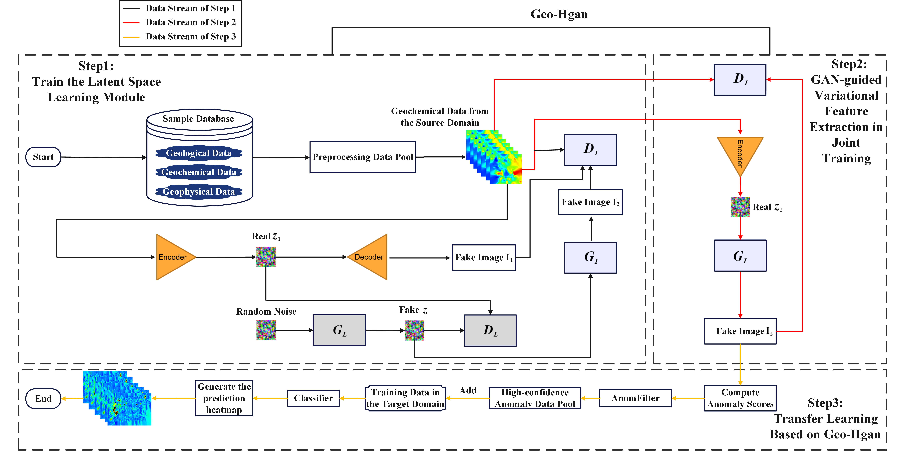

# Geo-Hgan-Unsupervised-Anomaly-Detection-via-mining-latent-space-features
## Research roadmap

## Step1: Train the Latent Space Learning Module
To train the latent space learning module, run the "train_LSTM.py" file. In this file, the "autoencoder.py" file in the nets folder defines the structure of the autoencoder. The "latent_GAN.py" file in the nets folder defines the structure of the latent space generative adversarial network, and the "sample_GAN.py" file in the nets folder defines the structure of the sample generative adversarial network.

The purpose of this step is to constrain the sample generation process by exploring the latent space features of the samples.

## Step2: GAN-guided Variational Feature Extraction in Joint Training
Run the "GAN_guided_train_encoder.py" file to further constrain the training of the encoder using the weights of the sample generative adversarial network  pre-trained in Step 1.

The purpose of this step is to use the pre-trained GAN to constrain the process of extracting variant features by the encoder, in order to identify the features of weak anomalous data.

## Step3: Evaluation of Anomaly Detection Performance

